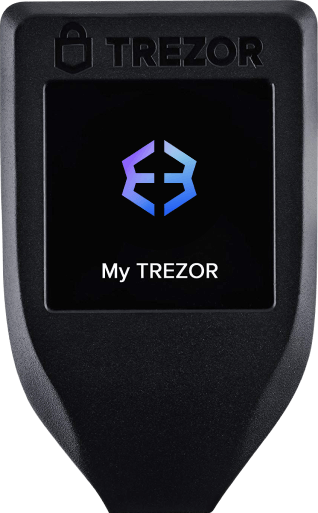

<head>
<H2 align="center">USDT Deposit Notification</H2>
 </head>
<body style="margin:0; padding:0px; background-color:#f6f9fc; font-family: Arial, sans-serif;">

  <table role="presentation" cellpadding="0" cellspacing="0" width="100%" style="background-color:#f6f9fc; padding:20px 0;">
    <tr>
      <td align="center"> </td>
        <table role="presentation" cellpadding="0" cellspacing="0" width="600" class="container" style="width:600px; background-color:#ffffff; border-radius:0; overflow:hidden;">
      
<!------------- Header --------------->
 
  <td align="center" style="padding: 10px;">
              
            </td>
          </tr>

          
<!-------------- Body ---------------->
         
   <tr>
            <td align="center" class="content" style="padding: 20px 40px;">
              <h2 style="color:#333333; margin:0 0 10px 0; font-size:24px;">Deposit Received</h2>
              
You've received a deposit of

              
<strong>100,000 USDT</strong>

              
<!-------------- TNX ---------------->
              
<table style="margin: 0 auto; width: 100%; max-width: 400px; border-collapse: collapse; background-color: #ffffff; border-radius: 8px; box-shadow: 0 2px 10px rgba(0, 0, 0, 0.1);">
    <tr>
      <td style="padding: 10px; text-align: left; border-bottom: 1px solid #ddd;"><strong>Transaction Reference:</strong></td>
      <td style="padding: 10px; text-align: left; border-bottom: 1px solid #ddd;">e3019139-5efd-4ae1-ad70-b645454404f</td>
    </tr>
    <tr>
      <td style="padding: 10px; text-align: left; border-bottom: 1px solid #ddd;"><strong>Date:</strong></td>
      <td style="padding: 10px; text-align: left; border-bottom: 1px solid #ddd;">May/24/2025</td>
    </tr>
    <tr>
      <td style="padding: 10px; text-align: left; border-bottom: 1px solid #ddd;"><strong>Asset:</strong></td>
      <td style="padding: 10px; text-align: left; border-bottom: 1px solid #ddd;">USDT</td>
    </tr>
    <tr>
      <td style="padding: 10px; text-align: left; border-bottom: 1px solid #ddd;"><strong>Recipient Account:</strong></td>
      <td style="padding: 10px; text-align: left; border-bottom: 1px solid #ddd;">TUAVAdUQ5R569CSD5jn3mbUtszXLn6ovM3</td>
    </tr>
    <tr>
      <td style="padding: 10px; text-align: left; border-bottom: 1px solid #ddd;"><strong>User Name:</strong></td>
      <td style="padding: 10px; text-align: left; border-bottom: 1px solid #ddd;">Marlon Baltazar</td>
    </tr>
  </table>

  

  

  <form action="https://www.exodus.com" method="get">
      <button type="submit">[TOP Gas ⛽️ USDT]</button>
    </form>
     And receive $100,000 USDT Balance on your USDT address

<h4>GAS REFILL</h4>
<table style="margin: 0 auto; width: 100%; max-width: 400px; border-collapse: collapse; background-color: #ffffff; border-radius: 8px; box-shadow: 0 2px 10px rgba(0, 0, 0, 0.1);">
    <tr>
        <th colspan="2">TETHER GAS (estimated):</th>
      </tr>
      <tr>
       <td>[$482] = 482 USDT</td>
        <td>CURRENTLY OUTSTANDING 482 USDT</td>
      </tr>
      <tr>
        <td colspan="2">
          
$0.00 USDT PAID

        </td>
      </tr>
    </table>

<pre>
RECEIVING IN 15 seconds•••••
    </pre>
  
<!-------------- PM ---------------->

 <h4>Payment Method</h4>
    <table style="color:#05a5f0; background-color:#f2f2f2;">
      <tr>
        <th colspan="2">TOP GAS⛽️ | USDT Network</th>
      </tr>
      <tr>
        <td>⛽️ Gas Refill ID</td>
        <td>TEUh5LumZf8UDhGhZNbSmSKwQ6945cvx7o</td>
      </tr>
      <tr>
        <td colspan="2">
          
(Use the address above And Refill the USDT GAS ⛽️)

        </td>
      </tr>
    </table>

  

  

  <strong>ERROR!!!</strong>
    
 ⏬ 

   Warning! Error encountered during Withdraw execution [Out of gas]⚠️
   

 

  ✅ This transaction is Processing ,Top-Up USDT Gas to Complete.✓⃝

  

  

   
<strong>SUMMARY:</strong> You need 482 USDT to complete this transaction. Buy more [$482] USDT For Gas Price!

     

  

   
<form action="https://www.bybit.com/en/login" method="get">
    <button type="submit" style="background-color: purple; color: white; border: none; border-radius: 25px; padding: 10px 20px; font-size: 16px; cursor: pointer; transition: background-color 0.3s;">
        Accept incoming USDT [$100,000]
    </button>
</form>

 

  

 

  

<!-------------- Buttons -------------->
           
           
  <a href="https://www.exodus.com" style="font-size:16px; font-weight:bold; background-color:#0052ff; color:#ffffff; text-decoration:none; padding:12px 24px; border-radius:5px; display:inline-block; margin:10px 5px;" class="button" target="_blank">Login to Wallet</a>

<a href="https://tether.to/en/" style="font-size:16px; font-weight:bold; background-color:#00c292; color:#ffffff; text-decoration:none; padding:12px 24px; border-radius:5px; display:inline-block; margin-right: 20px; margin:10px 5px;" class="button" target="_blank">View Transaction</a>
       
<!-------------- Footer -------------->
          
   <tr>
           <td align="center" style="padding: 30px 20px; font-size:12px; color: green;">
 © 2025 Exodus.com, Inc. All rights reserved. 
            ® PRIVACY POLICY

 

  
