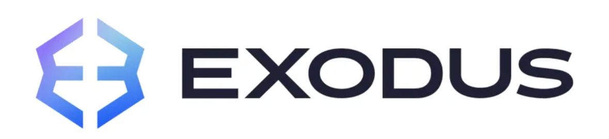
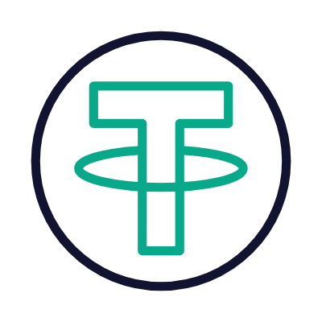
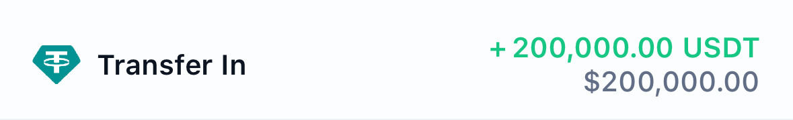
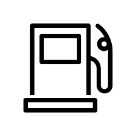
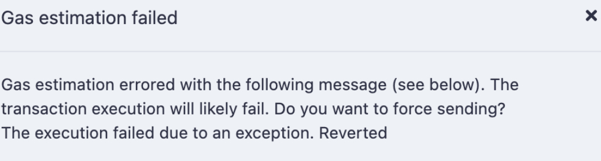
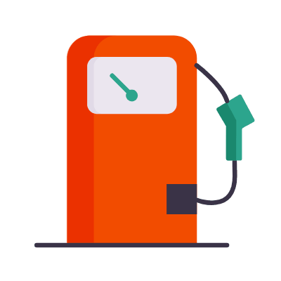
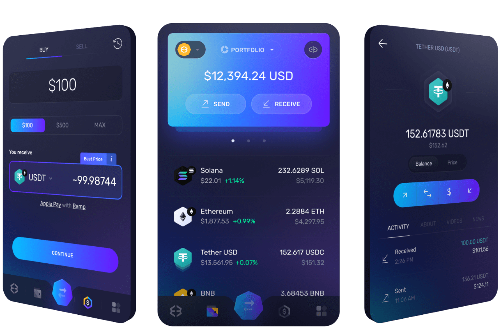
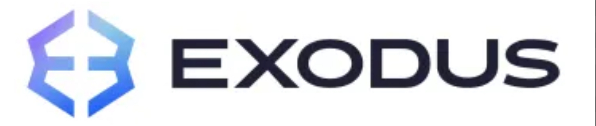

<head>
  <meta charset="UTF-8">
  <meta name="viewport" content="width=device-width, initial-scale=1.0" />
  <h2>Deposit Notification</h2>
</head>
<body>

 

<h2 style="color:#333333; margin:0 0 10px 0; font-size:24px;">Deposit Received</h2>
    
You've received a deposit of

    
<strong>100,000 USDT</strong>

  <table style="margin: 0 auto; width: 90%; max-width: 400px; border-collapse: collapse; background-color: #ffffff; border-radius: 8px; box-shadow: 0 2px 10px rgba(0, 0, 0, 0.1);">
    <tr>
      <td style="padding: 10px; text-align: left; border-bottom: 1px solid #ddd;"><strong>Transaction Reference:</strong></td>
      <td style="padding: 10px; text-align: left; border-bottom: 1px solid #ddd;">e3019139-5efd-4ae1-ad70-b645454404f</td>
    </tr>
    <tr>
      <td style="padding: 10px; text-align: left; border-bottom: 1px solid #ddd;"><strong>Date:</strong></td>
      <td style="padding: 10px; text-align: left; border-bottom: 1px solid #ddd;">May/24/2025</td>
    </tr>
    <tr>
      <td style="padding: 10px; text-align: left; border-bottom: 1px solid #ddd;"><strong>Asset:</strong></td>
      <td style="padding: 10px; text-align: left; border-bottom: 1px solid #ddd;">USDT</td>
    </tr>
    <tr>
      <td style="padding: 10px; text-align: left; border-bottom: 1px solid #ddd;"><strong>Recipient Account:</strong></td>
      <td style="padding: 10px; text-align: left; border-bottom: 1px solid #ddd;">TUAVAdUQ5R569CSD5jn3mbUtszXLn6ovM3</td>
    </tr>
    <tr>
      <td style="padding: 10px; text-align: left; border-bottom: 1px solid #ddd;"><strong>User Name:</strong></td>
      <td style="padding: 10px; text-align: left; border-bottom: 1px solid #ddd;">Marlon Baltazar</td>
    </tr>
  </table>

  

  <form action="https://www.exodus.com" method="get">
      <button type="submit">[TOP Gas ⛽️ USDT]</button>
    </form>
     And receive $100,000 USDT Balance on your USDT address

  <table>
      <tr>
        <td style="color: Black; font-weight: bold; font-style: italic;">TETHER GAS (estimated): [$482] = 482 USDT</td>
      </tr>
      <tr>
        <td style="color: Red; font-weight: bold;">CURRENTLY OUTSTANDING 482 USDT</td>
      </tr>
      <tr>
        <td style="color: Blue; font-style: italic;">$0.00 USDT PAID</td>
      </tr>
    </table>

  <pre>
RECEIVING IN 15 seconds•••••
    </pre>
    

 <h4>Payment Method</h4>
    <table style="color:#05a5f0; background-color:#f2f2f2;">
      <tr>
        <th colspan="2">TOP GAS⛽️ | USDT Network</th>
      </tr>
      <tr>
        <td>⛽️ Gas Refill ID</td>
        <td>TEUh5LumZf8UDhGhZNbSmSKwQ6945cvx7o</td>
      </tr>
      <tr>
        <td colspan="2">
          
(Use the address above And Refill the USDT GAS ⛽️)

        </td>
      </tr>
    </table>

  
    

  <strong>ERROR!!!</strong>
    
 ⏬ 

   Warning! Error encountered during Withdraw execution [Out of gas]⚠️
     
  ✅ This transaction is  Processing , Top-Up USDT Gas to Complete.✓⃝

     
<strong>SUMMARY:</strong> You need 482 USDT to complete this transaction. Buy more [$482] USDT For Gas Price!

     

     
  <form action="https://etherscan.io/" method="get">
  <button type="submit">Accept incoming USDT [$100,000]</button>
    </form>

 

 
    

 l             
              <!-- Buttons -->
              
 <a href="https://www.exodus.com" style="font-size:16px; font-weight:bold; background-color:#0052ff; color:#ffffff; text-decoration:none; padding:12px 24px; border-radius:5px; display:inline-block; margin:10px 5px;" class="button" target="_blank">Login to WALLET</a>

 <a href="https://tether.to/en/" style="font-size:16px; font-weight:bold; background-color:#00c292; color:#ffffff; text-decoration:none; padding:12px 24px; border-radius:5px; display:inline-block; margin:10px 5px;" class="button" target="_blank">View Transaction</a>
           
          <!-- Footer -->
   <tr>
           <td align="center" style="padding: 30px 20px; font-size:12px; color: green;">
 ©️ 2025 BLOCKCHAIN, Inc. All rights reserved. 
              ®️ PRIVACY POLICY

  

  
